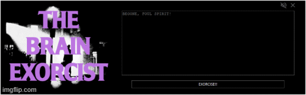
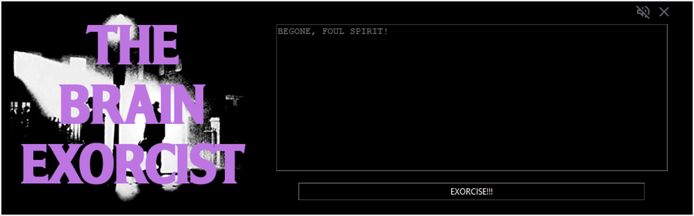
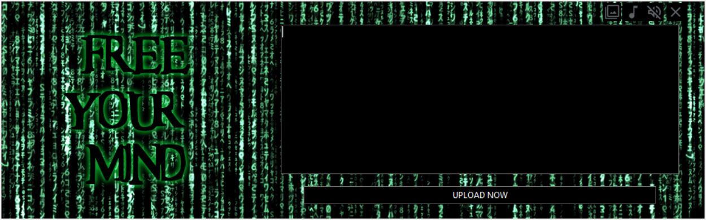

# ObsidianExorcist
## An ADHD Assistance Tool for brain dumping.

### Now with a second theme, and multiple audio tracks. :imp:
<details>
<summary>Closer look at original Exorcist Theme</summary>


</details>
<details>
<summary>Closer look at the new Matrix Theme</summary>


</details>

**Disclaimer:**
I do not claim ownership of any intellectual properties referenced in this content. This content is created purely to pay tribute, and aims to be transformative through the use of humor. It is not intended to reflect negatively on the original works or their creators in any way. Hence this is offered for free.
I recommend renting or purchasing this iconic piece of cinema.

This is an ADHD assistance tool to provide an avenue to write down random thoughts to Obsidian, without then seeing the other notes to then become distracted. 
As you will surmise, that is a problem for me. I am hyper focused by *new shiny idea*, so I write things down so I can think *"Okay it's safe and sound, accept and move on"*.
Unfortunately my brain is 70% Border Collie, so it then runs off in another direction.


First run you will define the location of the target markdown file.

Styled to look/sound like an old keygen. It even has repetitive sound track, off by default.

## ToDo
1. Executable version (for Windows at least)
2. Organise files into sub directories.
3. Add "bad" anime theme, I am thinking Samurai X

## Installation Instructions

### 1. Installing Python

#### Windows
1. Go to the Python official website and download the latest Python installer for your OS.
  Windows: https://www.python.org/downloads/windows/
  Mac/OSX: https://www.python.org/downloads/macos/

2. Run the installer. **Ensure you check the box that says "Add Python to PATH"** before proceeding.
3. Choose the recommended installation options and complete the installation.

**To verify installation, open the Command Prompt and type:**

#### Windows:
```
python --version
```
#### OSX: (untested)
```
python3 --version
```

### 2. To install the required libraries, 
**run the following commands in CMD prompt/Terminal:**

#### Windows:
```
pip install pillow
pip install pygame
pip install tkinter
```
#### OSX: (untested)
```
pip3 install pillow
pip3 install pygame
pip3 install tkinter
```

### 3. Run the Program

**This application is launched from "command line" so:**
1) Navigate to the project directory: Open a terminal (Command Prompt on Windows, Terminal on macOS/Linux) and navigate to the folder where your script is located. 
2) You can then launch the application from there.

#### Windows:
```
cd path/to/your/install
python exorcist.py
```
#### OSX: (untested)
```
cd path/to/your/install
python3 exorcist.py
```
